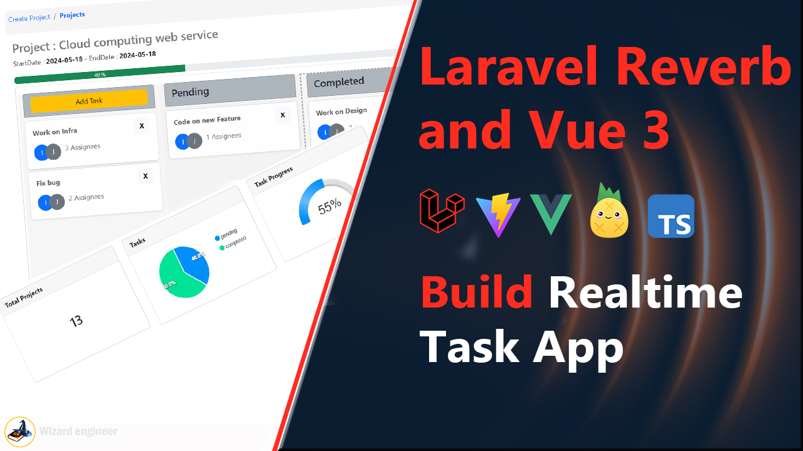

### Steps to run this project:

1. git clone `https://github.com/Bienfait-ijambo/laravel-11-vue-3-typescript`

2. cd in `in the project`

3. Run `composer install` command

4. run `npm install`

5. Run `php artisan migrate` 

6. Run `php artisan serve` command

7. Run `php artisan queue:work` for background process

8. Run `php artisan reverb:start` reverb server

9. Run `npm run dev` 

## You may also like :

[Watch the YouTube Video](https://www.youtube.com/watch?v=mimRnvHpsg0&t=1s)
### Build a realtime Task Manager app
